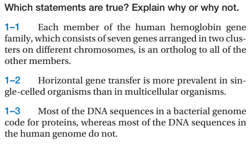

Chapter 1

1) False, because there is no speciation and it is still from the same species  
2) True, multicellular organism need to have gene transfer in germ cells out of many cells for it to be inherited  
3) ~~False, DNA sequences in the human genome should also code for proteins, it is the mtDNA or cpDNA that don't code for protein due to ist sequence moved to nucleus~~, True, cell size increase in proportion to genome size, this allow human DNA sequence to code for other thing other than proteins

