

Exercise 1.A

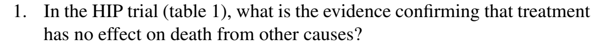

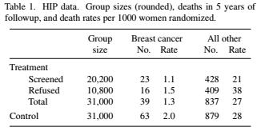

The rate of treatment group (27%) and control group (28%) have no significant difference

---

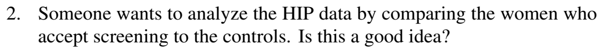

No, because of nonresponse bias

---

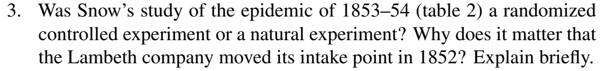

Natural experiment, it matters because we can see the difference between source of water

---

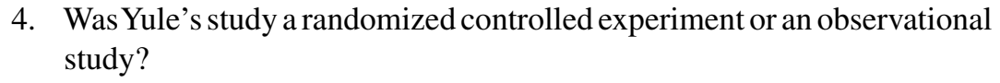

Observational study

---

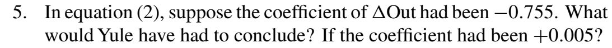

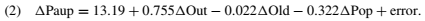

Out-relief negatively affect pauperism, no significant relationship

---

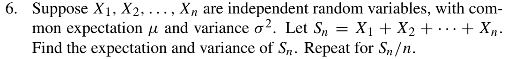

a) $SE = \sqrt{n}\times SD$  
${\alpha}^2 = {SE}^2 = n\times {SD}^2= n\times {\alpha}^2$  
$\mu=n\times\mu$ 

b) $SE = \sqrt{n}\times \frac{SD}{n}$  
${\alpha}^2 = {SE}^2 = n\times \frac{{SD}^2}{{n}^2}= \frac{{\alpha}^2}{n}$  
$\mu=\mu$ 

---

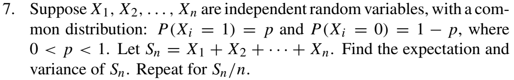

a) $\mu=n\times p$  
$SD = \sqrt{p\times(1-p)}$  
${\alpha}^2 = {SE}^2 = n\times{SD}^2 = n\times p\times (1-p)$

b) $\mu= p$  
$SD = \frac{\sqrt{p\times(1-p)}}{n}$  
${\alpha}^2 = {SE}^2 = n\times{SD}^2 = \frac{p\times (1-p)}{n}$

---

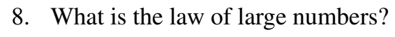

---

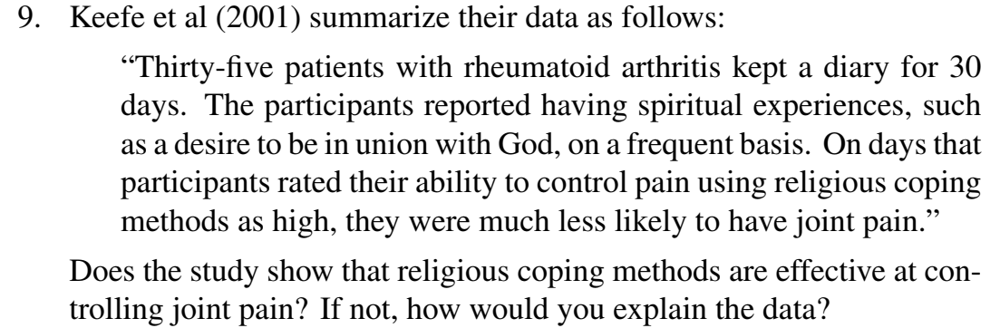

---

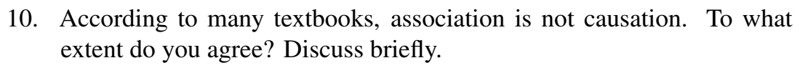

Exercise 2.A

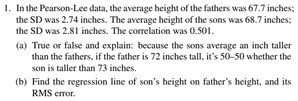

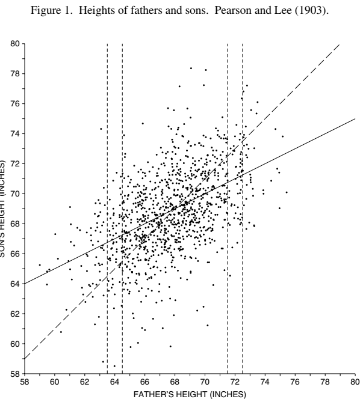

a) False, because the average of son's height is $r\times z_{i}$ so the difference between value to average is more important

b) $y = m\times x + b$  
$m = \frac{r\times SD_{x}}{SD_{y}} = \frac{0.501 \times 2.81}{274} \approx 0.5$  
$b=r\times \frac{x-\bar{x}}{SD_{x}}\times SD_{y} \approx -67.7 \times 0.5$  
$rms_{error} = \sqrt{1-r^2}\times SD_{y} = 0.86 \times 2.81 \approx 2.43$

---

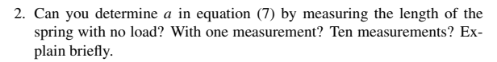

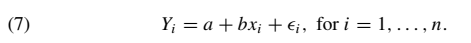

a) No, only b is found. b) No, cannot reduce it into one variable. c) Yes

---

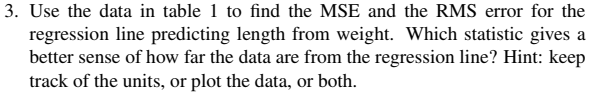

---

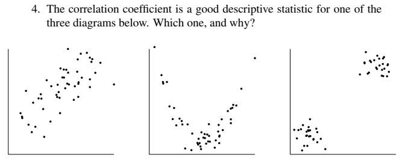

Exercise 2.B

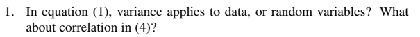

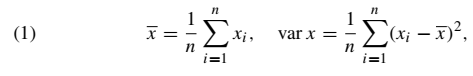

Data

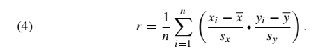

Data

---

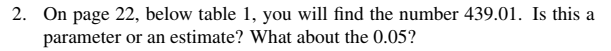

Both are estimates

---

---

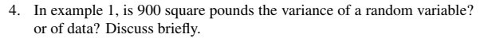

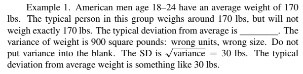

Data, because no chance is involved

---

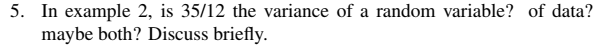

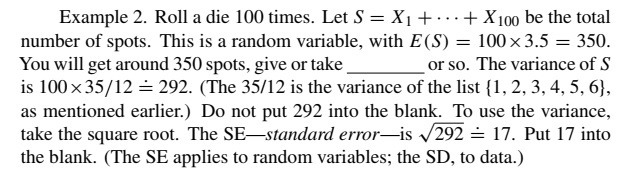

Random variable, because chance is involved

---

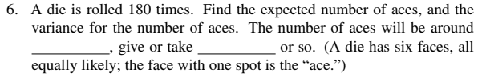

 $E(aces)=p(aces)\times n=\frac{1}{6}\times180=30$  
$var(Aces)= SE^2=n\times SD^2 = 180 \times 1/6\times5/6=25$ 

---

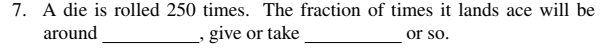

Fraction of times = Sn/n  
$E(aces)=p(aces)\times \frac{n}{n}=\frac{1}{6}$  
$var(Aces)= SE^2=\frac{1}{n}\times SD^2 = \frac{1}{250} \times 1/6\times5/6=\frac{1}{1800}$

---

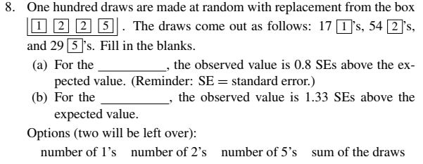

For 100 draws the expected value is 25, 50, 25 for each number. SE for each is $5/2\sqrt{3}$, $5$, $5/2\sqrt{3}$  
a) number of 2's  
b)number of 5's 

---

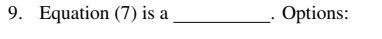

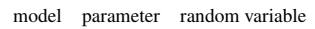

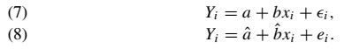

~~Parameter~~Model, which consist of parameters

---

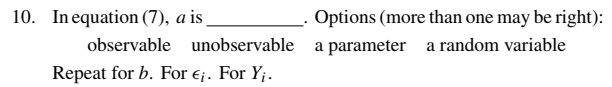

1) unobservable, parameter
2) unobservable, parameter  
3) unobservable, random variable   
4) unobservable, random variable (right = observable) 

---

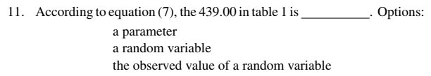

observed value of a random variable

---

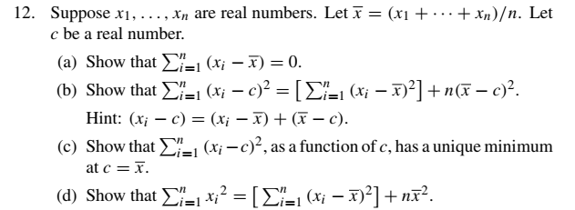

a $$\sum_{i=1}^{n}(x_{i}-\bar{x})=
\sum_{i=1}^{n}x_{i} - n\times(x_{1}+...+x_{n})/n$$
$$=(x_{1}+...+x_{n}) - (x_{1}+...+x_{n})=0$$  
b $$\sum_{i=1}^{n}(x_{i}-c)^2 =
\sum_{i=1}^{n}(x_{i}-\bar{x})^2+(\bar{x}-c)^2 +2\times((-\bar{x}^2)+\bar{x}(x_{i}+c)-x_{i}c)$$
$$=\sum_{i=1}^{n}(x_{i}-\bar{x})^2+n\times (\bar{x}-c)^2 +(-2n\bar{x}^2+2n\bar{x}c)+2(\bar{x}-c)n\bar{x}
=\sum_{i=1}^{n}(x_{i}-\bar{x})^2+n\times (\bar{x}-c)^2$$  
c as a function of c, $a+(y-c)^2$ is minimum when $y=c$ by taking derivatives  
d $$\sum_{i=1}^nx_{i}^2=
\sum_{i=1}^nx_{i}^2-\bar{x}^2+\bar{x}^2$$
$$=-n\bar{x}^2+\sum_{i=1}^n(x_{i}-\bar{x})^2+2n\bar{x}^2=
[\sum_{i=1}^n(x_{i}-\bar{x})^2]+n\bar{x}^2$$

---